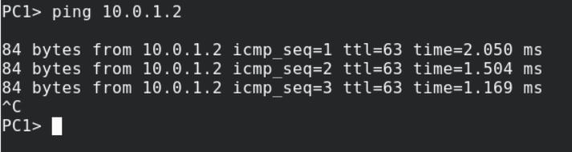
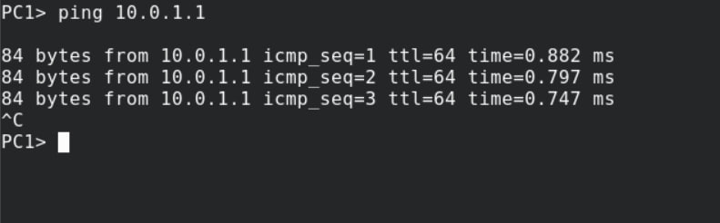
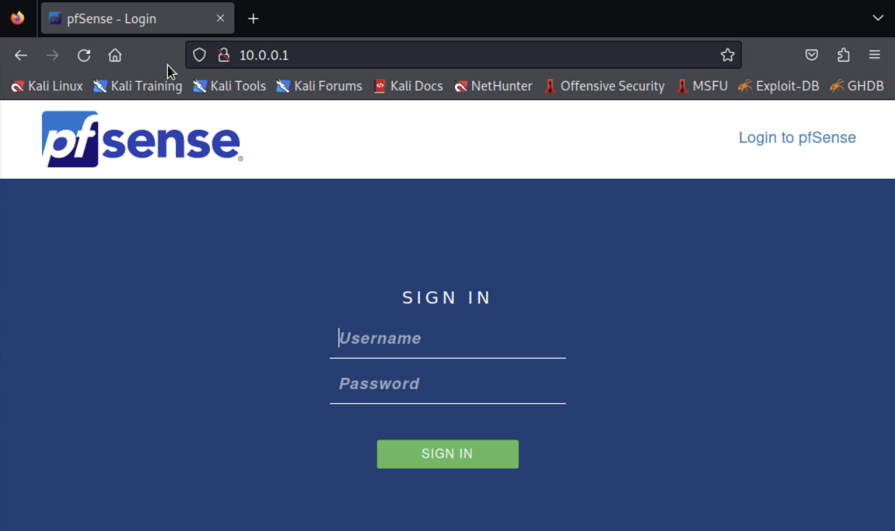
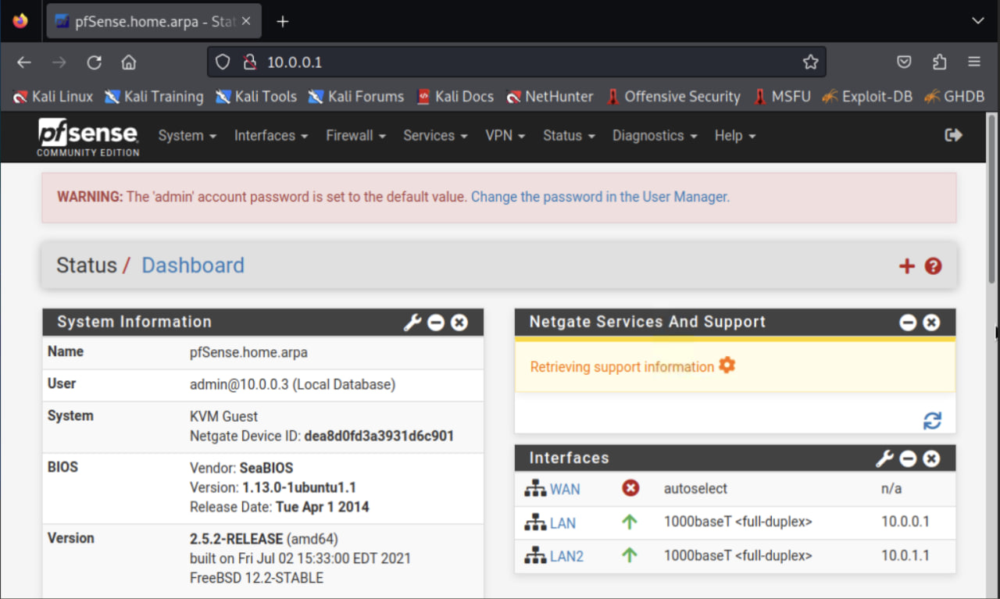
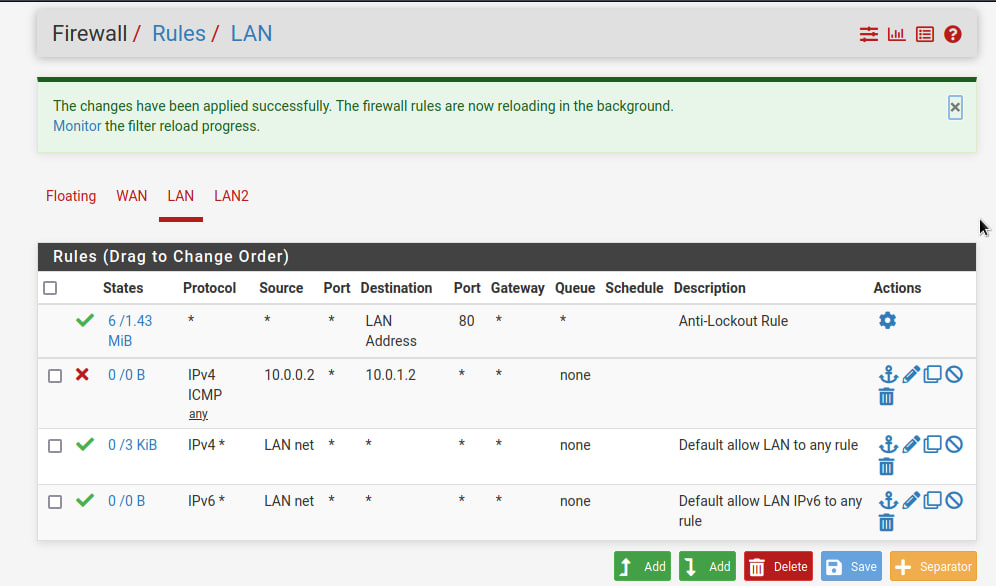
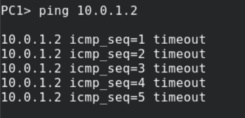
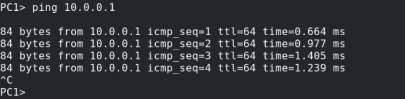

# Lab 03: pfSense Firewall Rules

## Overview

In this lab, I worked with pfSense, an open-source firewall and router distribution based on FreeBSD. The goal was to understand how network-level firewalls enforce rules and how rule ordering affects traffic behavior. I used GNS3 to simulate a small network with a pfSense firewall between two segments.

---

## Lab Environment

- Simulation Platform: GNS3 (running on Ubuntu)
- Firewall: pfSense
- Attacker / Client Machine: Kali Linux
- Other Hosts: Two virtual PCs (VPCs) on separate networks
- Access: pfSense WebGUI via browser

---

## Background Concepts

### What is pfSense?

pfSense is an open-source firewall and router distribution of FreeBSD. It is managed through a web-based interface called WebGUI, which makes complex firewall configurations accessible without requiring deep FreeBSD knowledge.

### Key Firewall Features in pfSense

| Feature | Description |
|---------|-------------|
| Aliases | Named groups of IPs, ports, or networks for reusable rules |
| NAT | Network Address Translation (inbound and outbound) |
| Rules | Traffic control rules applied per interface |
| Schedules | Time-based rules that activate only during specified windows |
| Traffic Shaper | QoS for prioritizing traffic |
| Virtual IPs | Additional IP addresses for an interface |

### Rule Processing

- Rules are evaluated top-down.
- The first matching rule is applied, and no further rules are evaluated.
- If no rule matches, the default "Deny All" rule applies.
- This makes rule ordering critical — more specific rules should be placed above general ones.

### Interfaces

- WAN: Controls traffic from external networks (e.g., internet).
- LAN: Controls traffic leaving the local network.

---

## Lab Objectives

1. Understand pfSense firewall rule structure.
2. Learn the importance of rule ordering.
3. Create a rule to block ICMP (ping) traffic between two hosts.
4. Verify that the rule works as intended.

---

## Methodology

### Step 1: Verify Initial Connectivity

From PC1, I pinged:
- PC2 (on a different network)
- The pfSense LAN interface

Result: All pings succeeded, confirming that the network was fully reachable before applying any rules.

### Step 2: Access the pfSense WebGUI

- Opened a browser and navigated to the pfSense WebGUI.
- Logged in with the admin credentials.
- Navigated to Firewall → Rules → LAN.

### Step 3: Create a Block Rule

I created a rule with the following parameters:
- Action: Block
- Protocol: ICMP
- Source: PC1's IP address
- Destination: PC2's IP address
- Description: Block ICMP between PC1 and PC2

After saving, I applied the changes and confirmed that the rule was placed correctly in the list.

### Step 4: Test the Rule

From PC1, I pinged:
- PC2 → Failed (rule is working as intended)
- The pfSense LAN interface → Succeeded (not affected by the rule)

---

## Key Observations

- The rule only affected traffic from PC1 to PC2, demonstrating granular control.
- The "Deny All" default rule is important — if no rule matches, traffic is dropped.
- Rule order matters: placing a general "allow" rule above a specific "block" rule would have overridden the block.
- pfSense's WebGUI makes advanced network security accessible without deep CLI knowledge.

---

## Lessons Learned

- pfSense is a powerful, flexible, and free firewall solution for network-level defense.
- Rule ordering and specificity are critical for correct behavior.
- Testing each rule after creation prevents unintended network disruption.
- Combining pfSense with IDS (like Snort) would provide layered defense.

---

## Tools Used

- pfSense
- GNS3
- Kali Linux
- Virtual PCs
- Web Browser
