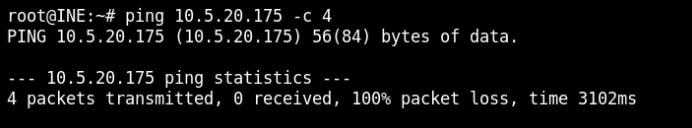
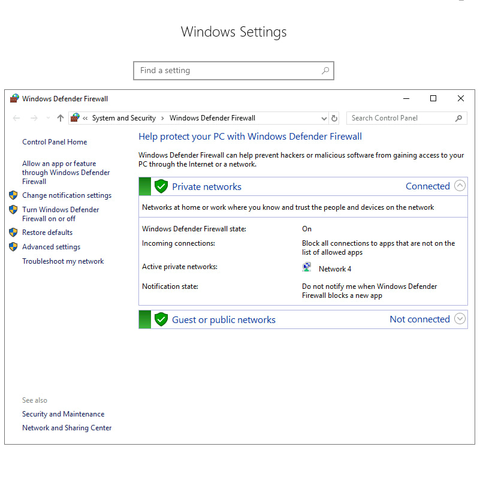
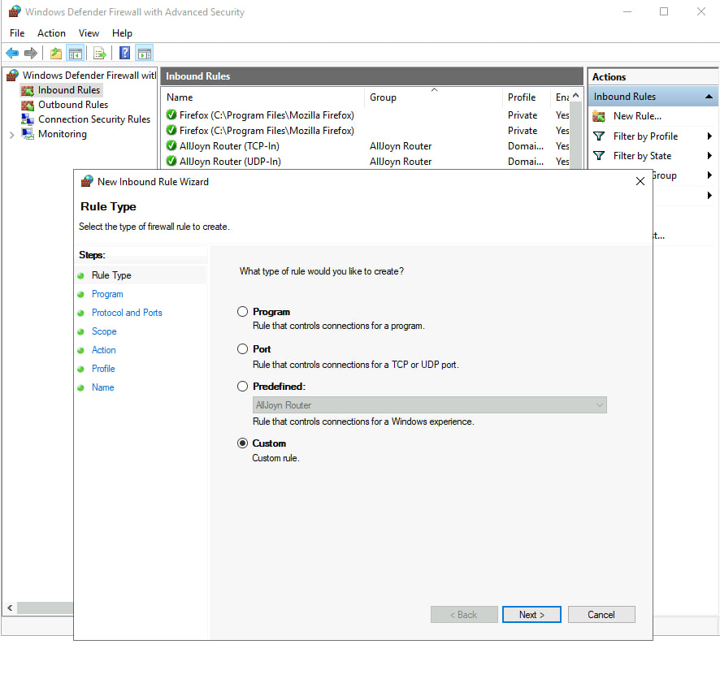
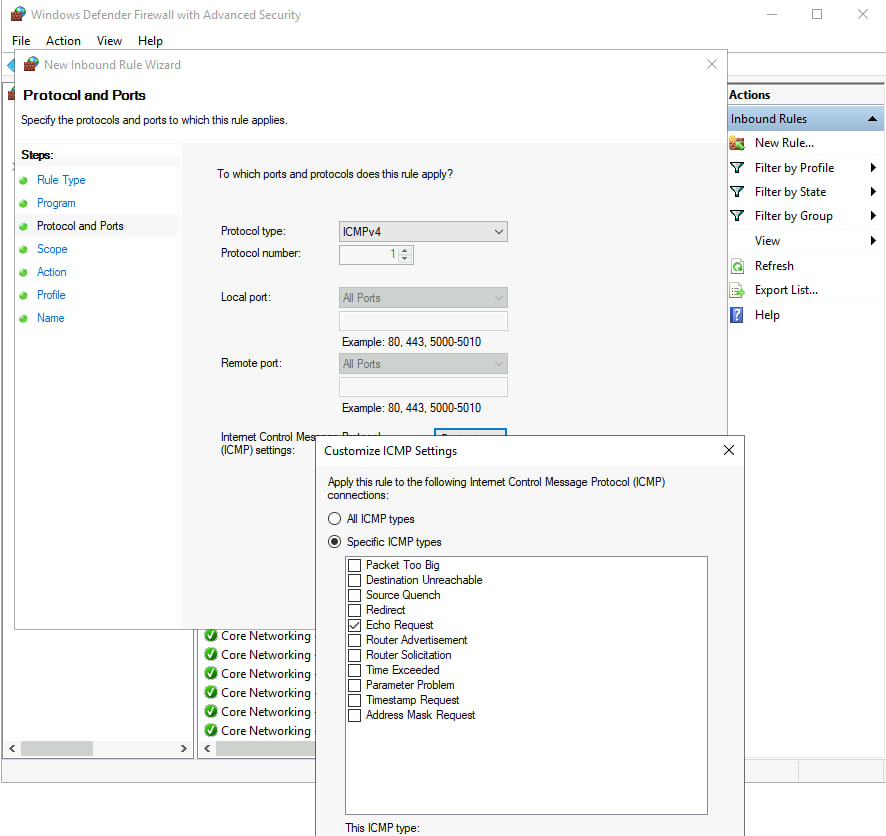
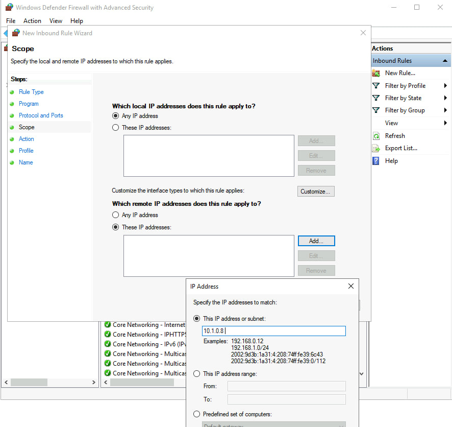
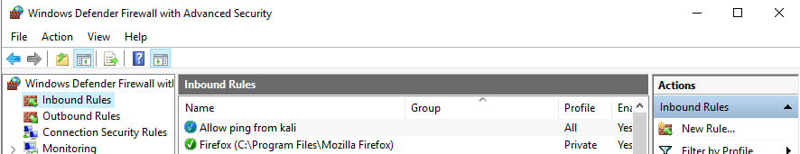
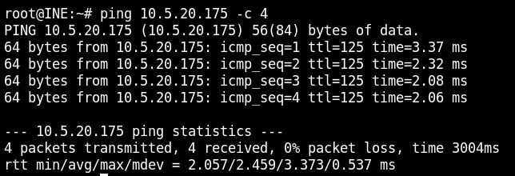

# Lab 02: Windows Defender Firewall Rules

## Overview

In this lab, I explored the Windows Defender Firewall on a Windows Server machine, focusing on how to create and manage inbound rules to control network traffic. The goal was to understand host-based firewalling and how to selectively allow or block traffic based on specific criteria.

---

## Lab Environment

- Attacker Machine: Kali Linux
- Target Machine: Windows Server 2019 (with Windows Defender Firewall enabled)
- Network: Isolated lab environment

---

## Background Concepts

### What is a Firewall?

A firewall is a network security device or software that monitors and controls incoming and outgoing traffic based on predefined rules. It acts as a barrier between trusted and untrusted networks.

### Types of Firewalls

| Type | Description |
|------|-------------|
| Packet Filtering | Examines packets and allows/blocks based on rules (Layer 3) |
| Stateful Inspection | Tracks active connections and makes context-aware decisions |
| Proxy / Application-Level | Operates at the application layer as an intermediary |

### Firewall Profiles in Windows

| Profile | When Applied |
|---------|--------------|
| Domain | Automatically applied when connected to an Active Directory domain |
| Private | For trusted networks like home or internal office networks |
| Public | For untrusted networks like public Wi-Fi (most restrictive) |

### Inbound vs. Outbound Rules

- Inbound Rules: Control traffic entering the device.
- Outbound Rules: Control traffic leaving the device.

---

## Lab Objectives

1. Understand how Windows Defender Firewall works.
2. Explore inbound and outbound rules.
3. Create a custom inbound rule to allow specific traffic.
4. Verify that the rule behaves as expected.

---

## Methodology

### Step 1: Verify Initial Blocking

- From Kali, I attempted to ping the Windows machine.
- Result: Ping failed, confirming the firewall was blocking ICMP traffic by default.

### Step 2: Access Advanced Settings

- Opened Windows Defender Firewall with Advanced Security.
- Navigated to Inbound Rules → New Rule.

### Step 3: Create a Custom Rule

I created a rule with the following parameters:
- Rule Type: Custom
- Program: All programs
- Protocol: ICMPv4
- ICMP Type: Echo Request (for pinging)
- Remote IP: Restricted to the Kali machine's IP only
- Action: Allow the connection
- Profiles: All (Domain, Private, Public)
- Name: Descriptive name for the rule

Key point: By restricting the remote IP to only the Kali machine, the rule allows ping only from that specific host, not from any arbitrary source.

### Step 4: Test the Rule

- From Kali, I pinged the Windows machine again.
- Result: Ping succeeded, confirming the rule works as intended.

---

## Key Observations

- Firewall rules can be fine-tuned by protocol, source IP, destination IP, port, and program.
- Restricting by source IP is a simple but effective access control measure.
- Default firewall behavior often blocks common traffic like ICMP, which is good for security but must be adjusted intentionally when needed.

---

## Lessons Learned

- Host-based firewalls are the first line of defense on individual machines.
- Rule design should follow the principle of least privilege — allow only what is necessary.
- Understanding inbound vs. outbound rules is essential for troubleshooting and hardening.

---

## Tools Used

- Windows Defender Firewall
- Windows Server 2019
- Kali Linux
- Command line
