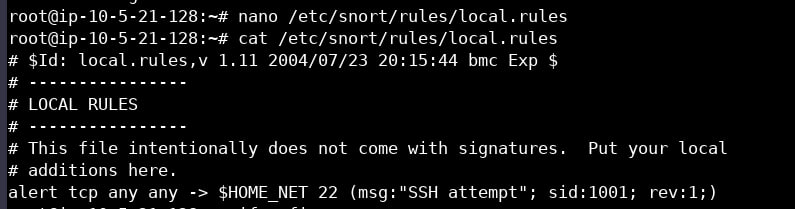
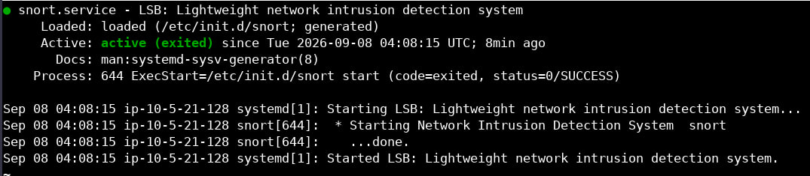
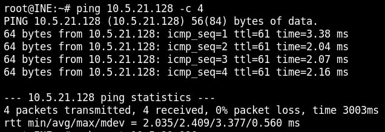
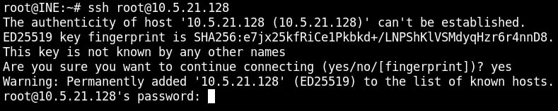
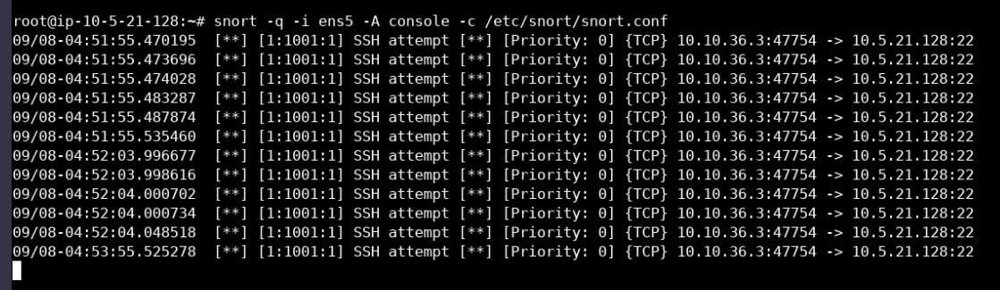

# Lab 01: Intrusion Detection with Snort

## Overview

In this lab, I explored Snort, an open-source Intrusion Detection and Prevention System (IDS/IPS), to monitor network traffic and generate alerts based on custom rules. The goal was to understand how signature-based detection works and how to write custom rules to detect specific activities.

---

## Lab Environment

- Attacker Machine: Kali Linux
- Target Machine: Ubuntu (with Snort installed)
- Network: Isolated lab environment

---

## Background Concepts

### What is an IDS?

An Intrusion Detection System (IDS) monitors network or system activity for malicious behavior and alerts administrators when suspicious patterns are detected. Unlike an IPS, an IDS does not block traffic — it only observes and reports.

### Types of IDS

| Type | Description |
|------|-------------|
| NIDS | Monitors traffic across an entire network subnet |
| HIDS | Runs on a single host and monitors its activity |
| PIDS | Focuses on protocol-specific traffic (e.g., HTTP/HTTPS) |
| APIDS | Monitors application-specific protocols (e.g., SQL) |
| Hybrid | Combines multiple approaches for broader coverage |

### Detection Mechanisms

- Signature-based: Matches traffic against known attack patterns.
- Anomaly-based: Uses machine learning to detect deviations from normal behavior.

### What is Snort?

Snort is a widely used open-source IDS/IPS that uses rules to define malicious network activity. It can act as:
- A packet sniffer (like tcpdump)
- A packet logger
- A full network intrusion prevention system

---

## Lab Objectives

1. Understand the role of IDS in network defense.
2. Learn Snort rule syntax.
3. Create a custom rule to detect SSH connection attempts.
4. Observe alerts generated by Snort.

---

## Methodology

### Step 1: Verify Snort Status

Checked that the Snort service was running on the target machine.

### Step 2: Disable Default Community Rules

To isolate the effect of my custom rule, I commented out the default community rules in the Snort configuration file. This ensured that only my custom rule would trigger alerts.

### Step 3: Validate Configuration

After modifying the configuration, I validated it to ensure there were no syntax errors before restarting Snort.

### Step 4: Create a Custom Rule

I added a custom rule in local.rules to detect any TCP traffic directed to port 22 (SSH):

Rule logic:
- Action: alert
- Protocol: TCP
- Source: any
- Destination Port: 22 (SSH)
- Message: "SSH attempt"
- SID: custom identifier

### Step 5: Start Snort in Monitoring Mode

I started Snort with console alert output so I could see alerts in real time.

### Step 6: Test the Rule

- From the Kali machine, I first pinged the target — no alerts appeared (expected, since the rule targets TCP/22, not ICMP).
- Then I attempted an SSH connection from Kali to the target.
- Result: Snort generated an alert on the target machine, showing the source IP, destination IP, and the custom message.

---

## Key Observations

- Custom rules allow targeted detection without noise from unrelated traffic.
- Rule ordering and syntax accuracy are critical — a single misplaced character can disable the rule.
- Snort alerts provide enough context (source, destination, port, message) to begin investigation.

---

## Lessons Learned

- Writing custom IDS rules is a fundamental skill for SOC analysts.
- Signature-based detection is powerful for known threats but limited against novel attacks.
- Combining IDS with a SIEM (like Splunk) would provide broader visibility and correlation.

---

## Tools Used

- Snort
- Kali Linux
- Ubuntu
- Terminal
