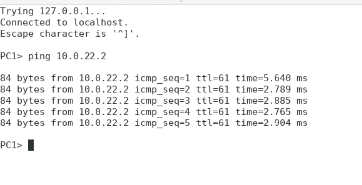
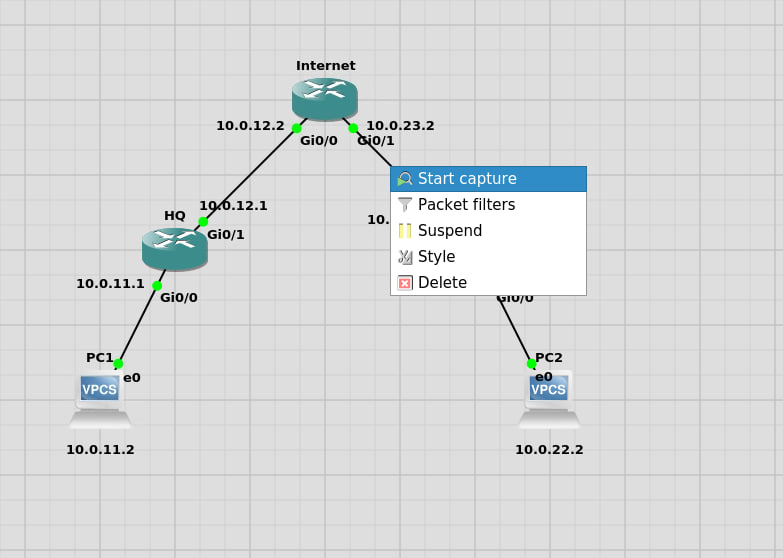
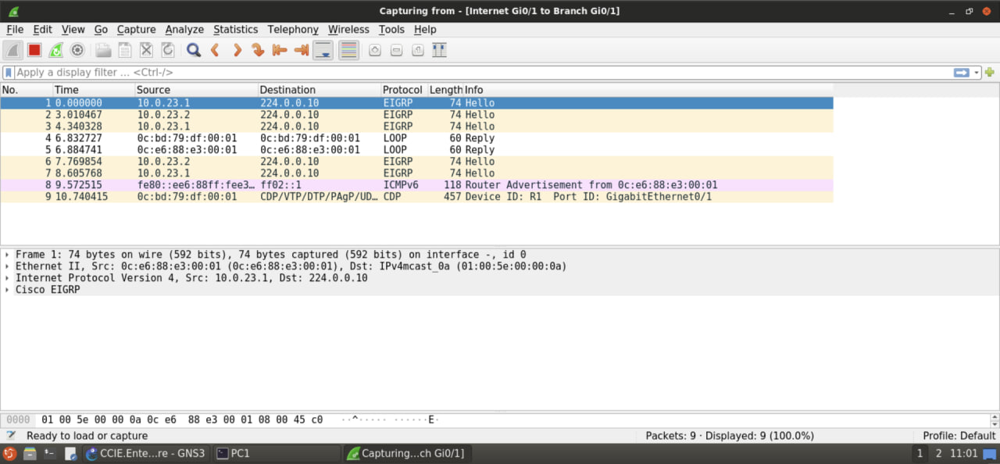
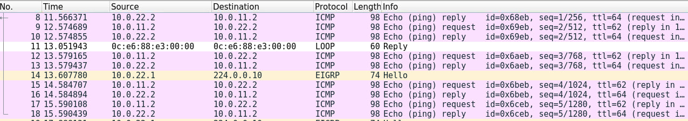
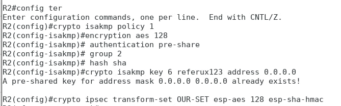
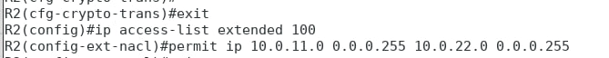
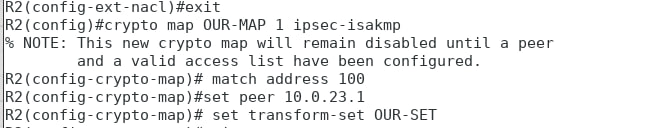
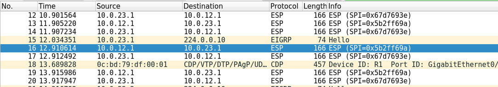

# Lab 04: IPsec Site-to-Site VPN

## Overview

In this lab, I configured an IPsec Site-to-Site VPN between two network segments (Headquarters and Branch) using GNS3. The goal was to understand how encrypted tunnels are established between routers, how IPsec protocols work together, and how to verify encryption using Wireshark.

---

## Lab Environment

- Simulation Platform: GNS3
- Routers: HQ Router and Branch Router
- Client Machines: PC1 (HQ network) and PC2 (Branch network)
- Analysis Tool: Wireshark (packet capture between routers)

---

## Background Concepts

### What is a VPN?

A Virtual Private Network (VPN) creates a secure, encrypted connection over a public network (like the internet). It allows devices in different geographic locations to communicate as if they were on the same private network.

### Types of VPN

| Type | Description |
|------|-------------|
| Remote Access VPN | Connects an individual user to a private network |
| Site-to-Site VPN | Connects two entire networks (e.g., two office locations) |

### Common VPN Protocols

| Protocol | Notes |
|----------|-------|
| IPsec | Secure suite for authentication and encryption; widely used in site-to-site |
| L2TP | Often combined with IPsec for encryption |
| PPTP | Outdated and insecure |
| SSL/TLS | Common in remote access VPNs |
| OpenVPN | Open-source, based on SSL/TLS |
| SSH | Used for encrypted remote access with port forwarding |

### What is IPsec?

IPsec (Internet Protocol Security) is a suite of protocols used to authenticate and encrypt data packets. It provides:
- Confidentiality through encryption
- Integrity through hashing
- Authentication of both peers
- Anti-replay protection

### IPsec Protocols

| Protocol | Purpose |
|----------|---------|
| AH (Authentication Header) | Verifies source and integrity (no encryption) |
| ESP (Encapsulating Security Payload) | Encrypts payload and provides integrity |
| IKE (Internet Key Exchange) | Negotiates keys and establishes Security Associations (SAs) |

### IPsec Modes

| Mode | Description | Use Case |
|------|-------------|----------|
| Tunnel Mode | Encrypts the entire original IP packet (including header) | Site-to-Site |
| Transport Mode | Encrypts only the payload, leaving the IP header intact | Host-to-Host |

---

## Lab Objectives

1. Understand how IPsec VPNs work.
2. Configure IPsec Site-to-Site VPN between two routers.
3. Verify that traffic is encrypted before and after configuration.
4. Analyze encrypted traffic with Wireshark.

---

## Methodology

### Step 1: Verify Pre-VPN Communication

- From PC1, I pinged PC2.
- Result: Ping succeeded, but Wireshark capture between routers showed unencrypted traffic — the source and destination IPs and the ICMP payload were visible.

### Step 2: Configure ISAKMP Policy on Both Routers

I configured the ISAKMP (Internet Security Association and Key Management Protocol) policy with:
- Encryption: AES-128
- Authentication: Pre-shared key
- Diffie-Hellman Group: 2
- Hash: SHA

This defines how the two routers will negotiate keys and authenticate each other.

### Step 3: Configure the Pre-Shared Key

I configured a pre-shared key on both routers. This key is used during the authentication phase of the VPN setup.

### Step 4: Configure the IPsec Transform Set

I defined a transform set specifying:
- Encryption: ESP with AES-128
- Integrity: ESP with SHA-HMAC

The transform set defines how the data will be encrypted and authenticated inside the tunnel.

### Step 5: Configure the Access Control List (ACL)

I created an extended ACL to define which traffic should be encrypted:
- On the HQ router: traffic from HQ network to Branch network.
- On the Branch router: traffic from Branch network to HQ network.

### Step 6: Configure the Crypto Map

I created a crypto map that:
- Matched traffic based on the ACL.
- Specified the remote peer's IP address.
- Applied the transform set for encryption.

The crypto map was then applied to the outbound interface on each router, activating the VPN.

### Step 7: Verify Encryption

- Restarted the packet capture between routers.
- Pinged PC2 from PC1 again.
- Result:
  - The traffic was now encrypted (ESP).
  - The original source and destination IPs were hidden.
  - Wireshark showed an ESP protocol with encrypted payload.

  

### Step 8: Verify Decryption at Destination

- Captured traffic between the Branch router and PC2.
- Result: Traffic was decrypted when leaving the Branch router and reached PC2 as normal ICMP.

---

## Key Observations

- IPsec VPNs use IKE for key negotiation and ESP for encryption.
- Tunnel mode encrypts the entire original packet, hiding source and destination IPs.
- Encryption begins at the HQ router and ends at the Branch router, creating a secure tunnel over the public network.
- Pre-shared keys must match on both peers for successful authentication.
- The ACL determines which traffic goes through the tunnel (not all traffic has to).

---

## Lessons Learned

- IPsec is a robust and widely used protocol for securing site-to-site communication.
- Configuration requires precise matching of parameters (encryption, hash, key, peer IP).
- Wireshark is invaluable for verifying that encryption is actually working.
- Encryption alone is not enough — authentication and integrity are equally important.

---

## Tools Used

- GNS3
- IPsec (IKE, ESP, ACL, Crypto Map)
- Wireshark
- Cisco IOS (router configuration)
